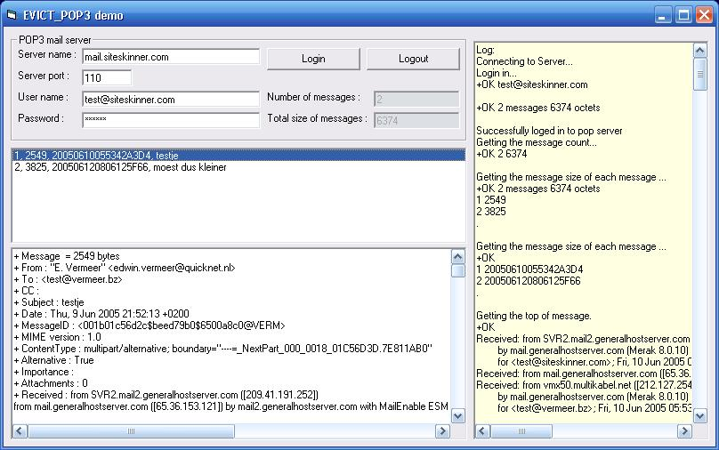



## POP3 library

### Description

This is a library for accessing a pop3 email box.

With this library you will be able to:

* Access any pop3 email box (if your network allows it)

* See what is in that mailbox (number of emails and sizes, etc.).

* Read the emails and delete them if you want to.

* Read all properties of an email.

* Handele Attachments

See the screenshot for most of the options that are available.

- - - - - - - - - - - - - - - - - - - - - - - - - - - - - - - - - - -

I am also working on a WebMail application that is using this library. It's for 80% finished. You can take a peek at it at http://www.evict.nl/open_source.asp

- - - - - - - - - - - - - - - - - - - - - - - - - - - - - - - - - - -

The TCP/IP communication is don by using the Generic Client object from the submition that I did earlier this week.

If you need a simple demo how this works, then have a look at http://www.planet-source-code.com/vb/scripts/ShowCode.asp?txtCodeId=62794&amp;lngWId=1

- - - - - - - - - - - - - - - - - - - - - - - - - - - - - - - - - - -

For testing purposes I have set up a test email account. This way the demo works without changing parameters. You can even send a test mail to that mail box. Don't over do it. There is a size limit on the box. If it's abused then i will just close the account.
 
### More Info
 

             |
---                |---
**Submitted On**   |2005-09-24 00:04:46
**By**             |[Edwin Vermeer\.](https://github.com/Planet-Source-Code/PSCIndex/blob/master/ByAuthor/edwin-vermeer.md)
**Level**          |Beginner
**User Rating**    |5.0 (65 globes from 13 users)
**Compatibility**  |VB 6\.0
**Category**       |[Libraries](https://github.com/Planet-Source-Code/PSCIndex/blob/master/ByCategory/libraries__1-49.md)
**World**          |[Visual Basic](https://github.com/Planet-Source-Code/PSCIndex/blob/master/ByWorld/visual-basic.md)
**Archive File**   |[POP3\_libra1938461072005\.zip](https://github.com/Planet-Source-Code/edwin-vermeer-pop3-library__1-62809/archive/master.zip)

